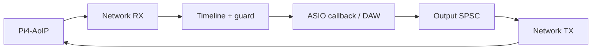

# Win11-asio-AoIP

**English** | [Русский](README.ru.md)

An ASIO driver for **Windows 11 x64**, providing up to 64 inputs and 64 outputs
over a wired network, a settings panel for profile configuration and an MSI
installer. Runs inside a 64-bit ASIO host.

**[Build](#build)** · **[How it works](#how-it-works)** · **[Documentation](#documentation)** · **[License](LICENSE)**

## Features

| Parameter | Support |
|---|---|
| Inputs / outputs | Independently configurable from 0 to 64 |
| Sample rate / format | Up to 192 kHz, PCM16/24/32 |
| ASIO buffer | 16 / 32 / 64 / 128 / 256 / 512 / 1024 / 2048 frames |
| Threads | Separate network receive, ASIO callback and network transmit threads |
| Reliability | SPSC queues, Timeline, TX deadlines and dropout counters |
| Settings | Discovery, profile, guard, RTT and per-user INI |
| Installation | MSI: ASIO/COM registration, settings panel, UDP firewall rule, repair and uninstall |

## How it works



This is an ASIO DLL. It **does not create Windows system microphone or speaker
endpoints**. Discord, Telegram and WASAPI applications require a separate
Windows Audio driver or routing layer. Windows ARM64 and 32-bit hosts are
not supported.

## Build

Requires CMake, Ninja, LLVM-MinGW x64/UCRT and a separately obtained Steinberg
ASIO SDK. The SDK is not included in this repository. See the
[ASIO SDK and licensing guide (Russian)](docs/ASIO-SDK.md).

```powershell
git clone --recurse-submodules https://github.com/danrey-bilo/Win11-asio-AoIP.git
cd Win11-asio-AoIP
./scripts/build.ps1 -ToolchainBin C:/Tools/llvm-mingw/bin -AsioSdkDir C:/SDK/asio
./packaging/msi/build-msi.ps1 -AsioSdkDir C:/SDK/asio
```

The DLL and EXE files are written to `build/windows/bin`; the MSI is written
to `dist`. Building does not register or install the driver. See the
[installation, network and settings guide (Russian)](docs/BUILD.md).

## Repository layout

```text
src/driver/        IASIO/COM, lifecycle and streaming engine
src/config/        profiles and per-user INI
src/control/       discovery and UDP commands
src/platform/      Windows MMCSS, affinity and timers
src/ui/            settings panel and resources
apps/              settings panel launcher
tools/             minimal ASIO host
external/AoIP-lib/  shared library pinned as a Git submodule
packaging/msi/     WiX installer
tests/             Windows configuration checks
docs/              API, architecture and guides
```

## Documentation

Detailed guides are currently available in Russian.

| Guide | Contents |
|---|---|
| [Build and installation](docs/BUILD.md) | Toolchain, MSI, network setup and settings |
| [ASIO host integration](docs/API.md) | Using the driver from your own host |
| [Architecture](docs/ARCHITECTURE.md) | Driver components, threads and audio data flow |
| [Technical overview](docs/TECHNICAL.md) | Transport characteristics and operating limits |
| [Testing](docs/TESTING.md) | Test procedure and measurement scope |
| [Build validation](docs/BUILD-VALIDATION.md) | Checks performed on the separated repository |
| [ASIO SDK](docs/ASIO-SDK.md) | External dependency and distribution conditions |

## Related projects

| Repository | Responsibility |
|---|---|
| [AoIP-lib](https://github.com/danrey-bilo/AoIP-lib) | Protocol, PCM, queues, timeline buffering and UDP peer |
| [Pi4-AoIP](https://github.com/danrey-bilo/Pi4-AoIP) | Raspberry Pi 4, PREEMPT_RT, Ethernet, CPU0/CPU1, systemd and DEB |
| [Win11-asio-AoIP](https://github.com/danrey-bilo/Win11-asio-AoIP) | ASIO DLL, Windows network threads, settings panel and MSI |

## License

Personal, noncommercial use is free. Commercial use requires a separate paid
written license from the copyright holder. See the [license terms](LICENSE)
or the [Russian explanation](docs/LICENSE-RU.md).

The ASIO SDK remains subject to its own terms; a commercial license for this
project does not replace them.
