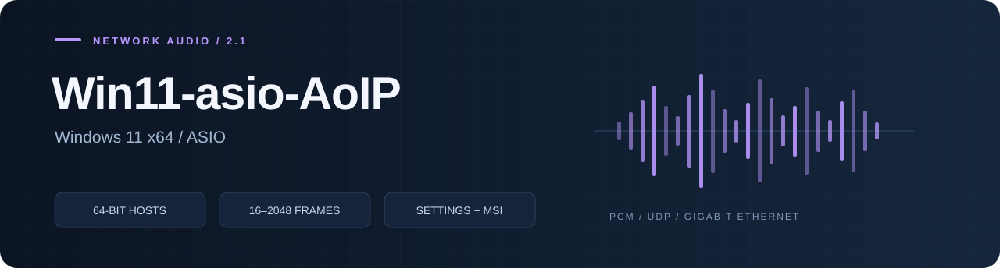
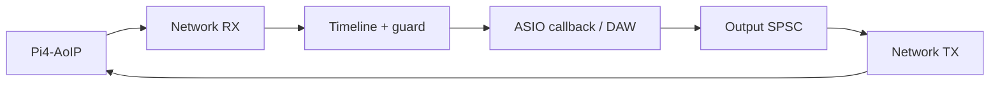

# Win11-asio-AoIP

ASIO-драйвер для **Windows 11 x64**: до 64 входов и 64 выходов по проводной
сети, настройка профиля из панели драйвера и установка через MSI.
Работает внутри 64-битного ASIO-хоста.

**[Начало работы](docs/BUILD.md)** · **[Архитектура](docs/ARCHITECTURE.md)** · **[Техническое описание](docs/TECHNICAL.md)** · **[Проверки](docs/TESTING.md)** · **[Лицензия](docs/LICENSE-RU.md)**

## Возможности

| Параметр | Поддержка |
|---|---|
| Входы / выходы | Независимо 0–64 |
| Частота / разрядность | До 192 кГц, PCM16/24/32 |
| ASIO buffer | 16 / 32 / 64 / 128 / 256 / 512 / 1024 / 2048 |
| Потоки | Приём, ASIO callback и отправка разделены |
| Устойчивость | SPSC, Timeline, ограниченные сроки TX, счётчики срывов |
| Настройки | Discovery, профиль, guard, RTT, INI пользователя |
| Установка | MSI: ASIO/COM, панель, UDP firewall, repair/uninstall |

## Как работает



Это ASIO DLL. Она **не создаёт системные устройства «микрофон/динамики» Windows**.
Для Discord, Telegram и WASAPI-приложений требуется отдельный Windows Audio
драйвер/маршрутизатор. Windows ARM64 и 32-битные хосты не поддерживаются.

## Сборка

Нужны CMake, Ninja, LLVM-MinGW x64/UCRT и отдельно полученный Steinberg ASIO SDK.
SDK не включён в репозиторий. [Лицензирование ASIO и зависимости](docs/ASIO-SDK.md).

```powershell
git clone --recurse-submodules https://github.com/danrey-bilo/Win11-asio-AoIP.git
cd Win11-asio-AoIP
./scripts/build.ps1 -ToolchainBin C:/Tools/llvm-mingw/bin -AsioSdkDir C:/SDK/asio
./packaging/msi/build-msi.ps1 -AsioSdkDir C:/SDK/asio
```

Выходные DLL/EXE находятся в `build/windows/bin`, MSI — в `dist`.
Сборка не регистрирует драйвер и не устанавливает его в систему.
[Установка, сеть и настройки](docs/BUILD.md).

## Структура

```text
src/driver/        IASIO/COM, жизненный цикл и движок потоков
src/config/        профиль и пользовательский INI
src/control/       обнаружение и команды UDP
src/platform/      MMCSS, affinity и таймеры Windows
src/ui/            панель настроек и ресурсы
apps/              запуск панели
tools/             минимальный ASIO-хост
external/AoIP-lib/  общая библиотека, закреплённая git submodule
packaging/msi/     WiX installer
tests/             конфигурация Windows
docs/              API, архитектура и инструкции
```

**[Подключение своего ASIO-хоста](docs/API.md)** · **[Техническое описание](docs/TECHNICAL.md)**

## Компоненты проекта

| Репозиторий | Ответственность |
|---|---|
| [AoIP-lib](https://github.com/danrey-bilo/AoIP-lib) | Протокол, PCM, очереди, временной буфер, UDP peer |
| [Pi4-AoIP](https://github.com/danrey-bilo/Pi4-AoIP) | Raspberry Pi 4, PREEMPT_RT, Ethernet, CPU0/CPU1, systemd и DEB |
| [Win11-asio-AoIP](https://github.com/danrey-bilo/Win11-asio-AoIP) | ASIO DLL, сетевые потоки Windows, панель настройки и MSI |

Личное некоммерческое использование бесплатно. Для коммерческого использования
требуется отдельная платная лицензия. [Условия](LICENSE) · [Пояснение](docs/LICENSE-RU.md).
