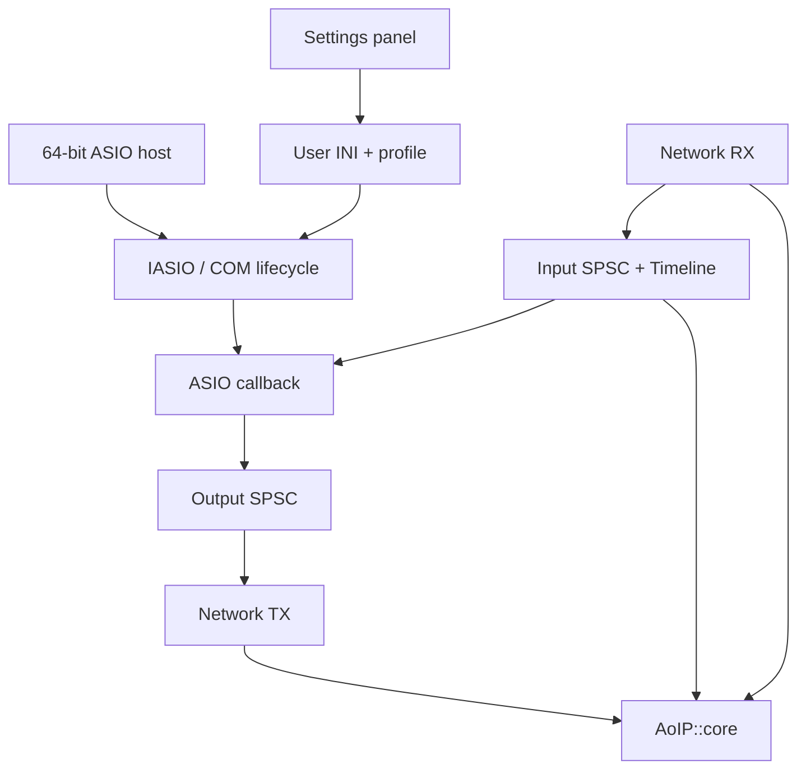

# Архитектура Windows ASIO

## Ответственность модулей

`driver` реализует COM/IASIO и управление жизненным циклом. `engine.inc` содержит
рабочие циклы RX/callback/TX. `config` отвечает за профиль и пути INI. `control`
выполняет discovery, подписку и подтверждение профиля. `ui` — Win32-панель и ресурсы.
`platform` — MMCSS, маски процессоров и высокоточное ожидание.

## Поток аудио

Сетевой RX не исполняет callback хоста. Callback не выполняет сокетную отправку:
он пишет в очередь TX. Пакетизация не равна ASIO-буферу и сохраняет MTU 1500.
Память выделяется заранее. Guard компенсирует ограниченную вариацию прихода UDP,
но увеличивает задержку. Превышение deadline отражается в счётчиках.

Управляющие операции, файловый ввод/вывод, обнаружение устройств и изменение
профиля выполняются вне активного callback. При смене профиля хост получает reset
request; его фактическое поведение зависит от ASIO-хоста.

## Установка и настройки

DLL загружается в процесс DAW через COM/IASIO. MSI регистрирует класс и ASIO entry,
создаёт локальное firewall-правило и ярлык панели. Это user-mode компонент без INF.
Настройки живут в LocalAppData либо явно заданном portable INI. Один активный
сетевой peer не является многоклиентным Windows Audio service.

## Границы

WDM/WaveRT/WASAPI endpoint, системный микрофон, общий микшер приложений, AES67/PTP
и аналоговый ADC/DAC round trip здесь не реализованы. Сеть использует собственный
протокол из [AoIP-lib](https://github.com/danrey-bilo/AoIP-lib/blob/main/docs/PROTOCOL.md).
